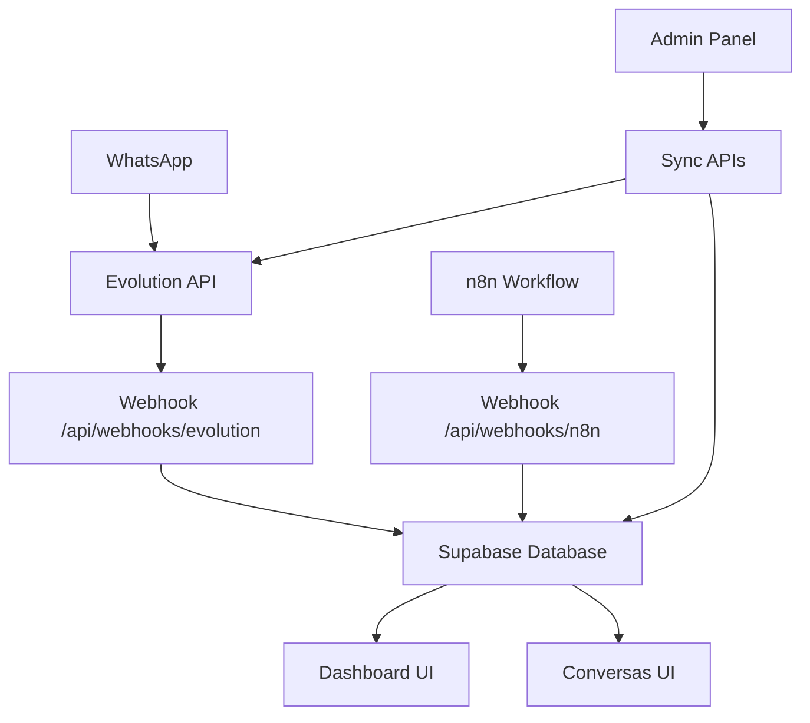

# Elis Dashboard - WhatsApp Conversations

Dashboard moderno para monitoramento de conversas WhatsApp integrado ao n8n e Evolution API. Interface elegante com tema claro/escuro, métricas em tempo real e visualização de dados interativa.

## 🚀 Características

- ✅ **Dashboard Completo** - Métricas de leads, taxa de resposta e gráficos interativos
- ✅ **Gestão de Conversas** - Visualização organizada por status (iniciadas, aguardando, finalizadas)
- ✅ **Integração Evolution API** - Sincronização automática de mensagens e contatos
- ✅ **Webhook n8n** - Recebimento de dados processados do n8n
- ✅ **Banco Supabase** - Armazenamento robusto com PostgreSQL
- ✅ **Tema Claro/Escuro** - Alternância automática com cores verdes personalizadas
- ✅ **Design Responsivo** - Layout adaptável para desktop, tablet e mobile
- ✅ **Painel Admin** - Monitoramento de sistema e sincronização manual
- ✅ **TypeScript** - Type safety completo
- ✅ **Real-time** - Atualizações automáticas via webhooks

## 🛠️ Tecnologias

- **Framework**: Next.js 14 (App Router)
- **Linguagem**: TypeScript
- **Estilização**: Tailwind CSS
- **Banco de Dados**: Supabase (PostgreSQL)
- **API Externa**: Evolution API
- **Automação**: n8n
- **Componentes**: Radix UI
- **Gráficos**: Recharts
- **Ícones**: Lucide React

## 🎨 Design

- **Cores Principais**: Verde (#1DB954), Branco, Verde Escuro (#103a25)
- **Fonte**: Fustat (Google Fonts)
- **Modo Escuro**: Verde claro e verde escuro
- **Animações**: Microanimações sutis para melhor UX

## 📦 Instalação e Configuração

### 1. **Clonar e Instalar**
```bash
git clone <seu-repositorio>
cd elis-dashboard
npm install
```

### 2. **Configurar Ambiente**
Crie o arquivo `.env.local` na raiz do projeto:

```bash
# Evolution API Configuration
EVOLUTION_API_URL=https://n8n-evolution-api.o5ynml.easypanel.host
EVOLUTION_API_TOKEN=F802E5ABFA6E-417B-A05D-856C7CB32C41
EVOLUTION_INSTANCE_NAME=Elis.IA

# n8n Configuration  
N8N_WEBHOOK_URL=https://n8n.elisia.site/webhook/jump-sheets
N8N_API_KEY=eyJhbGciOiJIUzI1NiIsInR5cCI6IkpXVCJ9...

# Supabase Configuration
SUPABASE_URL=https://mudmrbtnppvjmyvgypst.supabase.co
SUPABASE_ANON_KEY=eyJhbGciOiJIUzI1NiIsInR5cCI6IkpXVCJ9...
SUPABASE_SERVICE_KEY=eyJhbGciOiJIUzI1NiIsInR5cCI6IkpXVCJ9...

# Security
NEXTAUTH_URL=http://localhost:3000
NEXTAUTH_SECRET=elis-dashboard-secret-key-2025
WEBHOOK_SECRET=webhook-validation-secret

# App
NODE_ENV=development
APP_URL=http://localhost:3000
```

### 3. **Configurar Banco de Dados (Supabase)**

1. Acesse seu painel do Supabase
2. Vá em **SQL Editor**
3. Execute o SQL em `lib/database/schema.sql`
4. Verifique se todas as tabelas foram criadas

### 4. **Configurar Evolution API**

1. Configure webhook na Evolution API:
```bash
POST /webhook/set/{instance}
{
  "url": "https://seu-dominio.com/api/webhooks/evolution",
  "events": ["messages.upsert", "connection.update"],
  "enabled": true
}
```

### 5. **Configurar n8n**

1. No seu workflow n8n, configure webhook para:
   - URL: `https://seu-dominio.com/api/webhooks/n8n`
   - Método: POST
   - Headers: `Content-Type: application/json`

## 🚀 Executar Aplicação

```bash
# Desenvolvimento
npm run dev

# Build
npm run build

# Produção
npm start
```

Acesse: `http://localhost:3000`

## 📱 Funcionalidades

### Dashboard (`/`)
- **Métricas**: Total de leads, taxa de resposta, sem resposta, conversas hoje
- **Gráficos**: Pizza (taxa de resposta) e linha (dados semanais)
- **Tendências**: Indicadores de crescimento/diminuição
- **Ações Rápidas**: Recalcular métricas, ver conversas

### Conversas (`/conversas`)
- **Abas de Filtro**: Todas, Iniciadas, Aguardando Resposta, Finalizadas
- **Busca Avançada**: Por nome, telefone ou conteúdo da mensagem
- **Status Visual**: Ícones e cores indicando status
- **Atualização Automática**: Via webhooks da Evolution API

### Admin (`/admin`)
- **Health Check**: Status de todos os serviços
- **Sincronização**: Manual de contatos, conversas e mensagens
- **Métricas**: Recálculo manual das estatísticas
- **Monitoramento**: Logs de webhooks e atividade

## 🔗 Endpoints da API

### Webhooks
- `POST /api/webhooks/evolution` - Receber dados da Evolution API
- `POST /api/webhooks/n8n` - Receber dados do n8n
- `GET /api/webhooks/evolution` - Status do webhook Evolution
- `GET /api/webhooks/n8n` - Status do webhook n8n

### Dashboard
- `GET /api/dashboard` - Métricas, gráficos e dados semanais
- `POST /api/dashboard` - Recalcular métricas

### Conversas
- `GET /api/conversations` - Listar conversas com filtros
- `POST /api/conversations` - Criar nova conversa

### Sincronização
- `POST /api/evolution/sync` - Sincronizar dados da Evolution API
- `GET /api/evolution/sync` - Status da Evolution API

### Sistema
- `GET /api/health` - Health check completo
- `POST /api/health` - Verificar serviço específico

## 🔄 Fluxo de Dados



## 📊 Estrutura do Banco

### Tabelas Principais
- **contacts** - Contatos do WhatsApp
- **conversations** - Conversas/chats
- **messages** - Mensagens individuais
- **dashboard_metrics** - Métricas calculadas
- **webhook_logs** - Logs de webhooks

### Funções SQL
- `calculate_daily_metrics()` - Calcula métricas diárias
- `update_messages_count()` - Atualiza contador de mensagens
- Triggers automáticos para updated_at

## 🐛 Troubleshooting

### Problemas Comuns

1. **Webhooks não chegam**
   - Verifique URL no Evolution API
   - Confirme se o servidor está acessível
   - Veja logs em `/admin`

2. **Dados não aparecem**
   - Execute sincronização manual no Admin
   - Verifique configurações do Supabase
   - Confirme credenciais da Evolution API

3. **Métricas zeradas**
   - Use "Recalcular Métricas" no Dashboard
   - Verifique se há dados nas tabelas
   - Execute `calculate_daily_metrics()` no Supabase

### Logs e Debug

1. **Console do navegador** - Erros de frontend
2. **Terminal do Next.js** - Logs de API e webhooks
3. **Painel Admin** - Status de serviços
4. **Supabase Dashboard** - Logs de banco

## 🚀 Deploy

### Vercel (Recomendado)
```bash
npm run build
vercel --prod
```

### Configurações de Deploy
- Configure todas as variáveis de ambiente
- Ajuste URLs dos webhooks para produção
- Teste conexões com Evolution API e Supabase

## 🎯 Próximos Passos

- [ ] Sistema de notificações em tempo real
- [ ] Chat interface para responder mensagens
- [ ] Relatórios em PDF
- [ ] Integração com CRM
- [ ] Dashboard de analítics avançado
- [ ] Sistema de tags automáticas
- [ ] Backup automático

## 📄 Licença

Este projeto foi criado para integração WhatsApp + n8n + Evolution API.

## 🆘 Suporte

Para dúvidas ou problemas:
1. Verifique este README
2. Consulte os logs no painel Admin
3. Teste endpoints via `/api/health` 